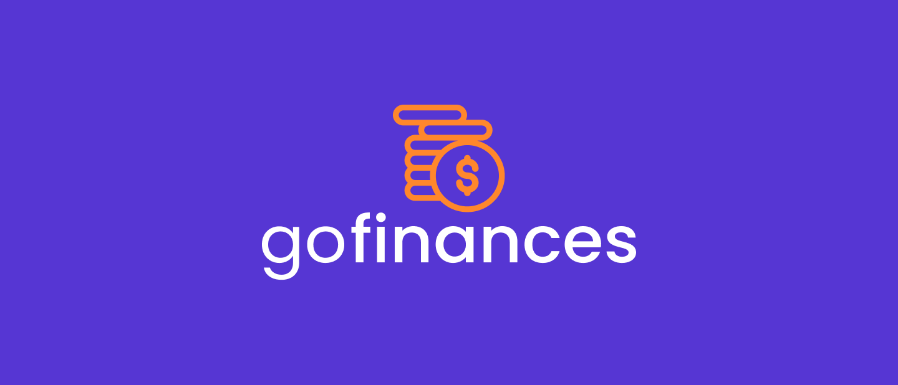
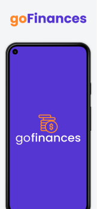
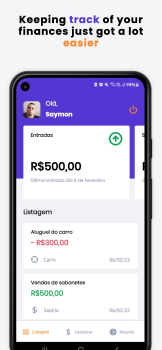
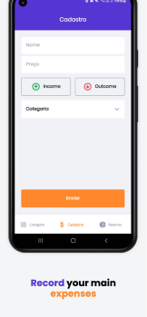
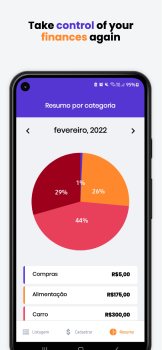

<h1 align="center">
    
</h1>

<h3 align="center">Expenses Manager App Project</h3>

<p align="center">
  
</p>

<p align="center">
 <a href="#description">Description</a> • 
 <a href="#technical-details">Technical details</a> •
 <a href="#features">Features</a> • 
 <a href="#how-to-use">How to use</a> • 
 <a href="#license">License</a>
</p>

<br>
<br>

# Description
<p>This project is about an app for expense control, in which the user can register his expenses and keep track of them over time. This project was developed during my bootcamp at Rocketseat.</p>


<div align="center">
  &nbsp;&nbsp;&nbsp;&nbsp;
  &nbsp;&nbsp;&nbsp;&nbsp;
  &nbsp;&nbsp;&nbsp;&nbsp;
  &nbsp;&nbsp;&nbsp;&nbsp;
</div>


<br>

# Technical details
<p>The project was developed using React Native, so it works on Android and IOS, and I used Expo Bare workflow to speed up the development.</p>

### Some of the concepts that were worked on during the project development are:


- OAuth authentication with Google and Apple
- Styles with Styled Components
- Forms with React Hook Forms
- Custom hooks and useContext
- Persistent Storage with Async Storage

<br>

# Features

- [x] Sign in with your Google or Apple account
- [x] See in the dashboard your expenses
- [x] Add a new expense
- [x] See a report of your monthly expenses

<p align="center">
  
</p>

<br>


# How to use

To run the project you will need to have the [Expo Tools](https://expo.dev/tools) configured, and [Yarn](https://classic.yarnpkg.com/en/docs/getting-started) installed. After this follow these instructions:

```bash
# Clone this repository to your local machine
$ git clone https://github.com/saymon-araujo/gofinances

# Navigate to the server
$ cd gofinances

# Install the server dependencies
$ yarn
$ expo install

# Run the bundle
$ expo start

# When the bundle runs, in your Expo Go App click on Scan QR Code and appoint the camera to the QR code.

<br>
<br>

# License

This project is under MIT license . [See it](https://github.com/saymon-araujo/rentx/blob/master/LICENSE) for more information.

---

Made by Saymon Araújo
<div>
 <p> Feel free to get in touch, it will be a pleasure to chat.</p>
  <a href="https://www.linkedin.com/in/saymon-araujo/" target="_blank"></a>
  <a href="mailto:saymonbrandon@gmail.com?subject=Hello%20Saymon,%20From%20Github"></a>
  <a href="https://t.me/saymon_araujo_dev"></a>&nbsp;&nbsp;&nbsp;&nbsp;
</div>
